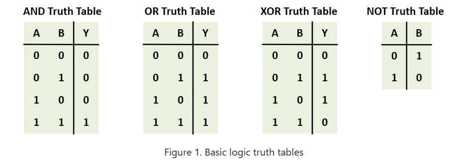
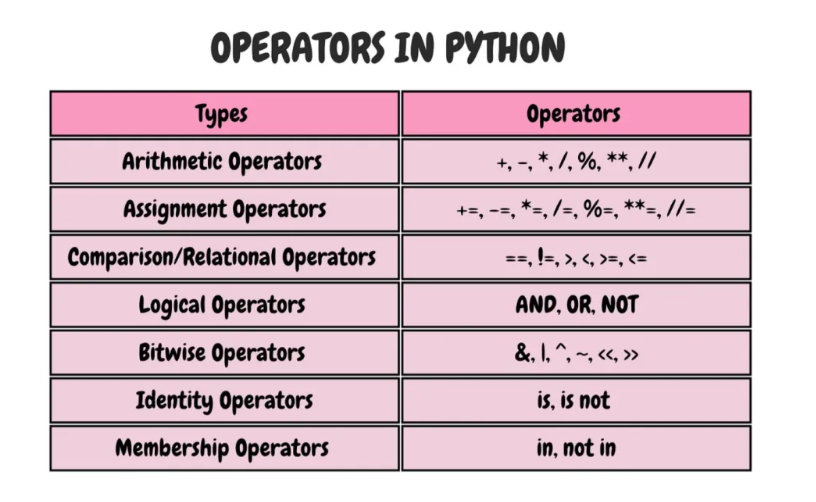

# A List of Python Programs.

  

<h3>AND</h3>: Returns true only if both conditions are true.  
<h3>OR</h3>: Returns true if at least one condition is true.  
<h3>XOR</h3>: Returns true if exactly one condition is true. (exclusive or) 
<h3>NOT</h3>: Inverts the value - true becomes false, false becomes true.  

# Operators in Python are special symbols or keywords that perform operations on variables and values, known as operands. They are fundamental tools for manipulating data, performing calculations, making comparisons, and controlling the flow of a program.

